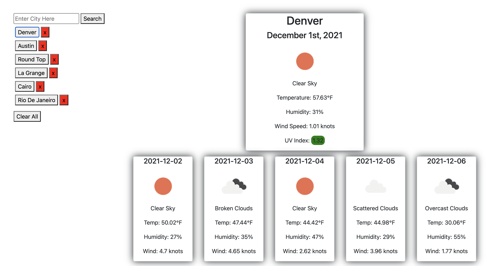

# Homework 6 - Weather Dashboard

## Description

For Homework 6 of the DU coding bootcamp I was tasked with creating a weather dashbaord using JavaScript and the OpenWeather API.

## Usage

If you would like to be able to use the day planner for yourself, you can access the website at the following link: https://chighum.github.io/Homework6-Weather_Dashboard

You can also what the deployed website looks like live in action below:

